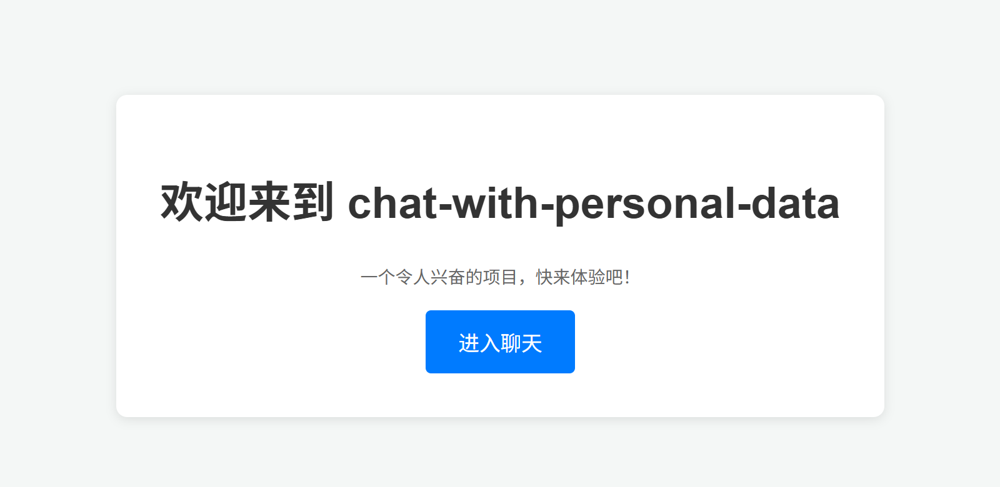

# chat-with-personal-data

基于Python使用LangChain和OpenAI进行搭建的个人知识库项目demo

<div align="center">


</div>

<div align="center">

中文 | [English](./README_en.md)

</div>

<div align="center">

[](LICENSE)


</div>

## 📌 项目介绍

这是我个人学习 `LangChain` 以及大预言模型(LLM)后进行练习尝试，实现的一个小 Demo。实现了通过大预言模型对个人数据的检索和问答系统，即个人知识库AI系统。

**功能实现情况如下：**

1. 支持的数据源

    | 数据源类型 | 是否支持 |
    | ---------- | -------- |
    | 本地文件(Markdown)   | <div align="center">✔️</div> |

2. 支持的大预言模型

    | LLM 类型 | 是否支持 |
    | ---------- | -------- |
    | OpenAI   | <div align="center">✔️</div> |

## 📌 快速开始

> [!IMPORTANT]
> 要访问大语言模型，可能需要科学上网！

<details>
<summary>本人软硬件环境配置（仅供参考）</summary>

- Windows 10
- VS Code 1.99.3 (system setup)
- Node.js: 20.18.3
- Python 3.13.3
- [requirements.txt](./requirements.txt)

</details>

### ✏️ 第1步

```bash
git clone https://github.com/arpenup/chat-with-personal-data.git
```

### ✏️ 第2步

```bash
pip install -r requirements.txt
```

### ✏️ 第3步

调整配置文件 `config.py`，在配置文件中使用 `LOACL_FILES` 指定读取的本地文件路径，默认路径为项目根目录下的 `app/resources/file_md`，你也可自定义选择路径位置。
根据你的需要，调整要使用的 OpenAI 的模型版本。

### ✏️ 第4步

在项目根目录创建 `api_key.txt` 文件，并添加你的 OpenAI API Key。格式如下：

```Plain Text
OPENAI_API_KEY=你的API_Key

```

### ✏️ 第5步

启动项目的 `run.py` 文件，运行项目。


